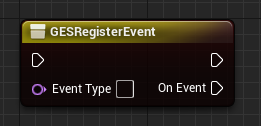
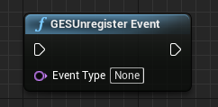

# 蓝图
## API
* 注册事件：`GESRegisterEvent`  

* 反注册事件：`GESUnregisterEvent`  

* 触发事件：`GESDispatchEvent`  

## 用法
### 注册事件
填写`EventType`后自动识别事件ID，并自动生成对应数量和对应类型的事件数据Pin  

例如下面这里填入`BoolTestEvent`后，自动生成了类型为bool的事件数据Pin：  

### 反注册事件
填写`EventType`即可，节点会自动反注册当前蓝图绑定对应EventType的回调  

### 触发事件
同`GESRegisterEvent`，填写`EventType`后自动识别事件ID，并自动生成对应数量和对应类型的事件数据Pin  
  

> 更多详情参见蓝图 [BP_GESTest.uasset](../../GESProj/Content/Blueprints/BP_GESTest.uasset)