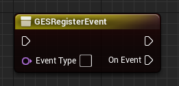
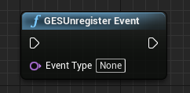
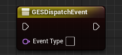

# Blueprint
## API
* Register Event  
`GESRegisterEvent`  

* Unregister Event  
`GESUnregisterEvent`  

* Dispatch Event  
`GESDispatchEvent`  

## Usage
### Register Event
Fill in `EventType`，then it will recognize event ID and create event data pins match the type automatically  

eg：  

### Unregister Event
Fill in `EventType`，then is will unbind callback for this event in current blueprint automatically  

### Dispatch Event
Same as `GESRegisterEvent`  
  

> See more：[BP_GESTest.uasset](../../GESProj/Content/Blueprints/BP_GESTest.uasset)