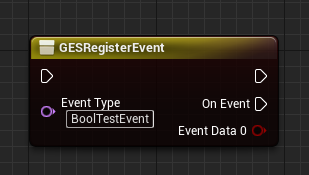
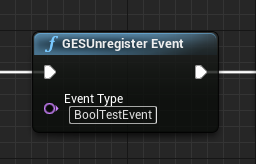
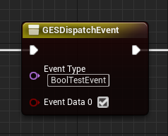

# GlobalEventSystemForUE

## 概述
GES(GlobalEventSystem)，基于UE(当前版本4.26)开发的全局事件系统。  
功能特性：
* **实现三端数据互通**  
  GES支持C++/Lua/蓝图三端数据互通
* **蓝图支持（亮点）**  
  蓝图层做了深度封装，支持自动生成对应类型的事件数据Pin，便捷使用  
    
    
  
  > 更多参见：[蓝图功能详细说明](Docs/CN/Blueprint.md)
* **事件数据配置热加载**  
  采用lua table配置方式，简单且支持热加载，便于蓝图编辑和调试
* **轻量**  
  框架设计简单，结构清晰
* **易扩展**  
  可以根据项目实际情况考虑扩展或修改部分功能
* **易使用**  
  配置简单，蓝图/lua/C++都做了深度封装，开发使用简单
## 引擎支持
目前支持`UE4.26`以及`UE5.3`
> * UE4.26之前不保证
> * UE4.26+理论上可以支持，引擎底层变化不大，并且都是使用C++11
> * UE5.3以前可能存在一些问题，因为UE5.3开始使用了C++20，之前版本的UE5都是C++17(如果有需要后续补一个UE5+版本)
## 安装
[安装GES到本地项目](Docs/CN/Installation.md)
## 如何使用
* [事件数据配置](Docs/CN/CppEventConfig.md)
* [C++](Docs/CN/C++.md)
* [蓝图](Docs/CN/Blueprint.md)
* [Lua](Docs/CN/Lua.md)

> 如果有任何问题，欢迎技术交流  
> **我的博客**：[bluecoder](https://www.zhihu.com/people/bluecoder_lxh)  
> **我的邮箱**：bluecoder@yeah.net